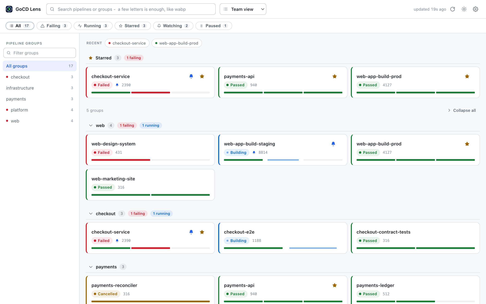
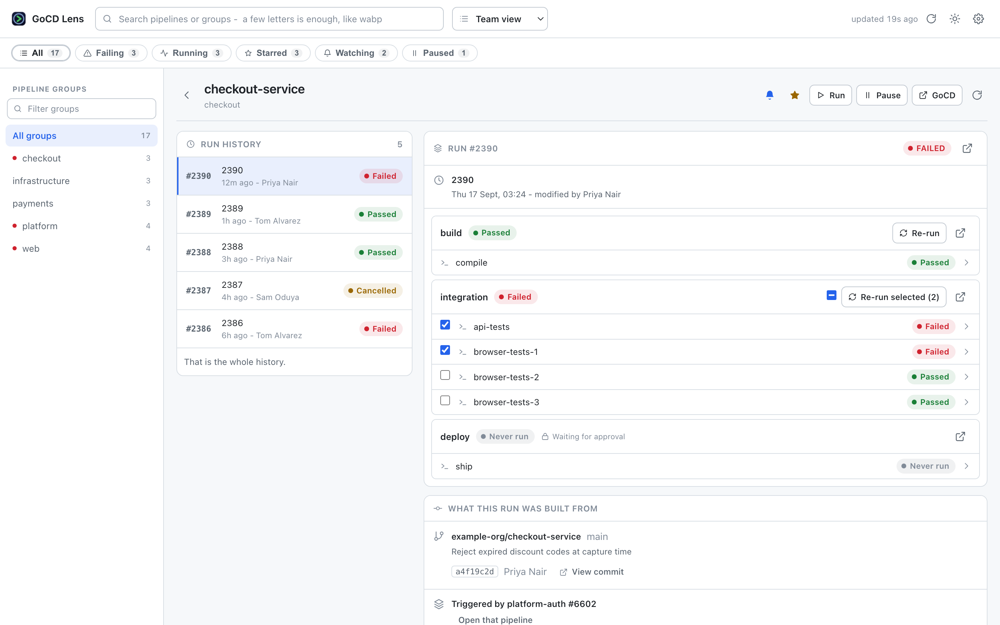
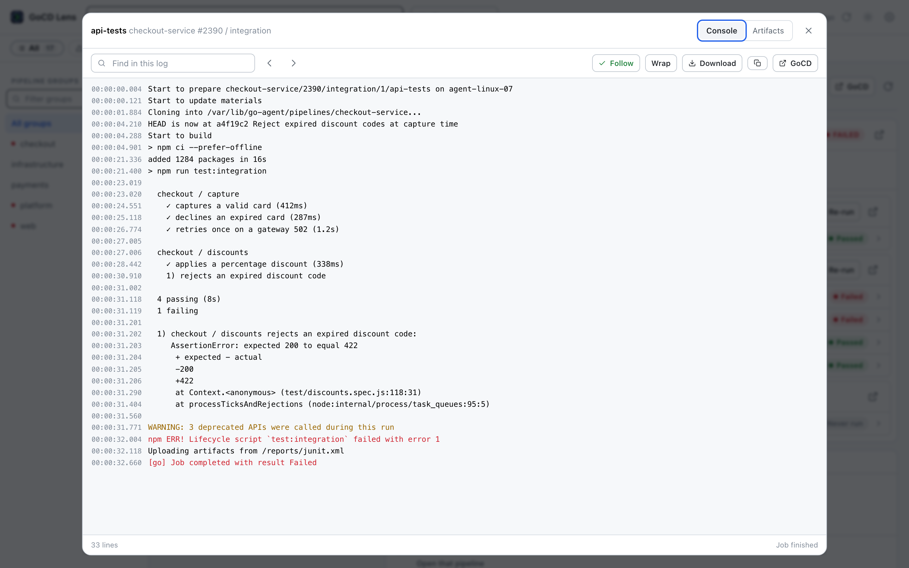
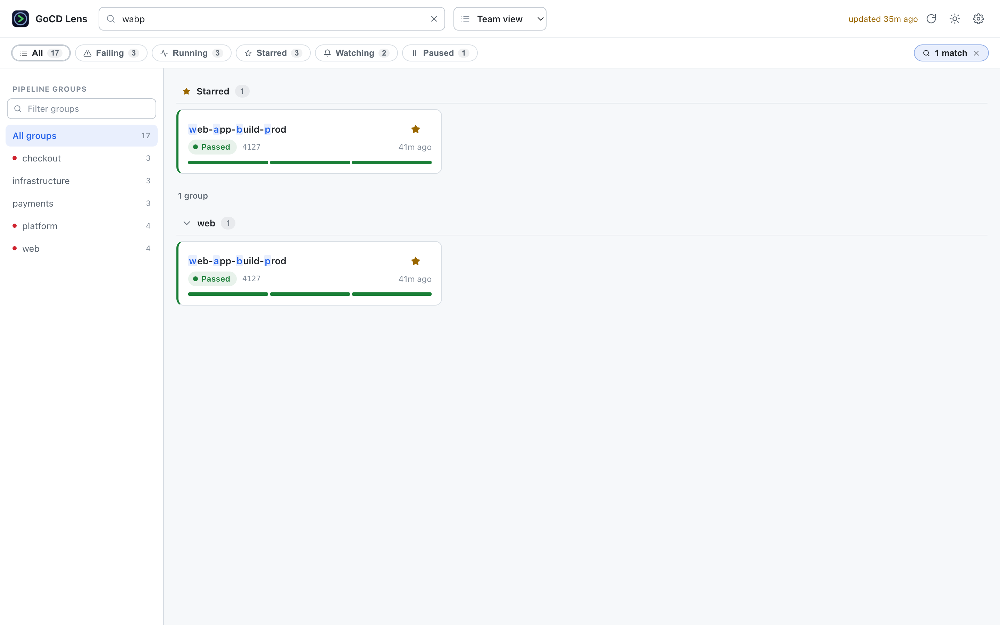
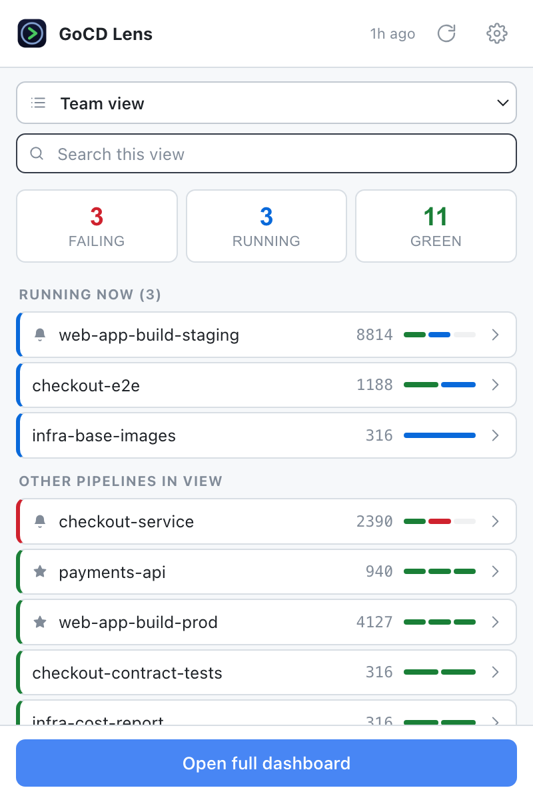
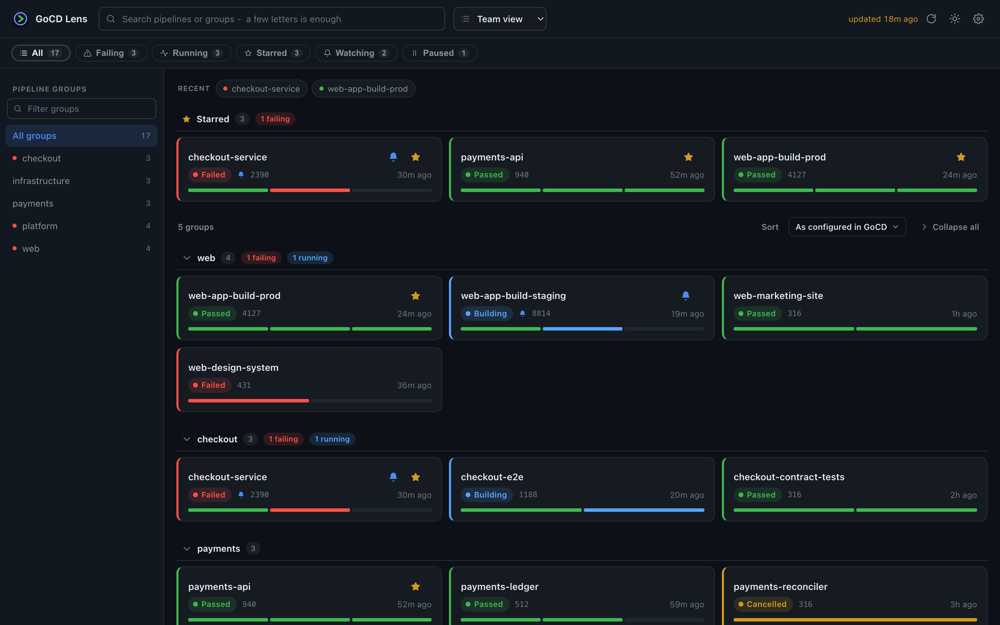
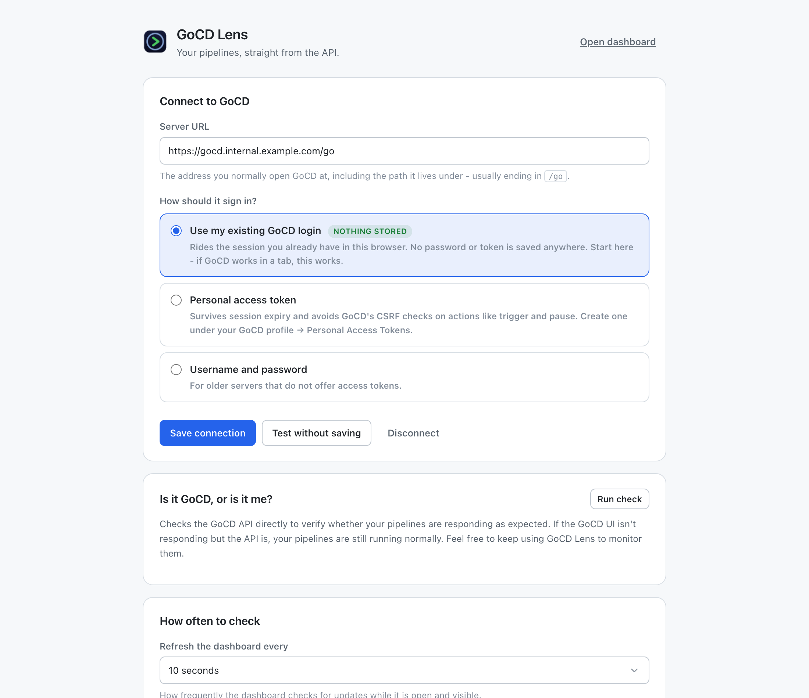

# GoCD Lens

**A Chrome extension that shows your GoCD pipelines even when the GoCD web UI won't.**

GoCD's API keeps answering correctly through server restarts, slow page loads, and the
dashboard's habit of losing your pipelines. The web UI in front of it does not. GoCD Lens skips
that page entirely: it reads the same REST API and draws its own dashboard, so what you see is
whatever the server actually knows.

Everything it stores stays on your machine. It asks for no access to any website until you name
your GoCD server, has no content scripts, loads no remote code, and sends nothing anywhere except
the server you point it at.

---

## What it looks like

**The pipeline list.** Every group and pipeline from one request, each card carrying a per-stage
strip so you can see *where* a run broke without opening it. Starred pipelines pin to the top;
groups below them fold.



**One pipeline.** Run history on the left, the selected run's stages and jobs on the right, and
underneath it the commit, branch, author and the upstream run that triggered it.



**The console log**, tailed while the job runs, fetching only the new lines. Severity colouring,
search with next/previous, wrap, download, and the artifact tree behind the second tab.



<details>
<summary><b>Fuzzy search, the toolbar popup, and dark mode</b></summary>

Type a few letters in any order. `wabp` finds `web-app-build-prod`, with the matched letters
picked out:



The popup, for a five-second glance from the toolbar — the same view picker, what is running now,
then everything else:



The whole thing follows your system theme, or you can pin it light or dark:



</details>

> These are the real pages, not mockups: the same HTML, CSS and modules the extension ships,
> rendered against a fixture GoCD server and photographed by `npm run screenshots`. The pipelines
> in them are invented — no real server's data appears here.

---

## What it does

**The pipeline list**

- Every group and pipeline you can see, loaded in **one request** and cached to disk, so opening
  the tab paints instantly and stays readable when the network is gone
- Colour-coded cards with a per-stage strip, so you can see *where* a run broke without clicking
- Filter chips: failing, running, starred, paused
- Fuzzy search — type `wabp` to find `web-app-build-prod`, matched letters highlighted
- Star the pipelines you care about; they pin to the top of every list
- Grouped into sections the way GoCD organises them, in the server's own order, each foldable —
  groups start collapsed, and opening one shows everything in it
- **A view picker in the centre**: your GoCD personalized views, the same tabs as the web
  dashboard, plus two the extension provides — **Starred** and **Watching**. It opens in your
  starred pipelines when you have any, so a six-thousand-pipeline server is never the landing page

**One pipeline**

- Full run history that pages automatically as you scroll
- Each run's stages and jobs, with manual-approval gates marked
- What the run was built from: repo, branch, commit, author and message, one click to the commit
- Chained pipelines show the upstream run that triggered them, one click away

**Acting on things**

- Run, pause, resume
- Stop a running stage
- **Re-run chosen jobs.** A stage of a dozen parallel e2e jobs is normal, and
  re-running all of them to retry one flaky job wastes agents and minutes. The
  job rows carry a checkbox, with the failed ones already ticked, and the button
  reads *Re-run selected (n)* until every job is picked -- which is the whole stage
- Every one of these confirms first, and says what happened

**Console logs**

- Live tailing while the job runs, fetching only the new lines
- Search with next/previous, severity colouring, line wrapping
- Download the whole log, or copy it
- The artifact tree, with files opening in a new tab

**Watching a pipeline**

Press the bell on any pipeline and you are told when a run **starts** and again when it
**finishes** — saying whether it passed and, if not, which stage went red — with a short chime
(a blip on start, a rising note on success, two beeps on failure — each previewable from Settings,
or switched off). A failure stays on screen until acknowledged; a pass does not.

This is separate from starring, which only pins a pipeline to the top of the list. Wanting
something in easy reach and wanting to be interrupted by it are different wishes.

It notifies on the *change*, never the state, and remembers run counters as well as statuses — so
a pipeline that starts and finishes between two polls is still reported, and one that has been red
all week stays quiet.

**Alerts arrive at the next check, not the instant something happens.** GoCD offers no push channel
of any kind, so the extension finds out when it next asks — within your refresh interval while a
dashboard tab is open and visible, within the background interval otherwise, and only when you
press refresh if you have turned both off. Settings spells out the actual delay for your
configuration rather than leaving you to work it out.

Two separate switches have to be on for anything to appear: your browser's, which Settings reads
and warns about, and your operating system's, which no extension can see — macOS System Settings →
Notifications, or Windows Settings → Notifications. Settings names your actual browser in those
paths, since this runs on Edge and Brave too. It also has a **Send a test notification** button,
which is the only check that covers both.

**In the background**

- A toolbar badge describing the pipelines **you** picked out — what you are watching, else what
  you starred, else the open view, and settable explicitly. Blue is the number **running**, because
  that is the thing that changes; with nothing running it turns red and counts failures; an amber
  `!` means it is showing cached data because GoCD is unreachable. The tooltip names the set, and
  says so when the open view hides some of what you watch rather than quietly undercounting
- A broader "anything turned red" alert for pipelines you are not watching, scoped to your
  starred ones or everything
- A popup for a five-second glance, with the same view picker and a search box

**When something is wrong**

- A "is it GoCD or is it me?" check that probes the API and the web UI separately and times both.
  When the API answers and the web UI doesn't, it says so plainly — that is the situation this
  extension exists for.

---

## Install

It is not on the Chrome Web Store, so load it from disk:

1. Open `chrome://extensions`
2. Turn on **Developer mode** (top right)
3. Click **Load unpacked** and pick this folder
4. The setup page opens. Enter your GoCD URL — the one you normally open, usually ending in `/go`.

There is no build step. No npm install, no bundler, no transpiler — the files in `src/` are the
files that run.

<details>
<summary>Rolling it out to a team</summary>

`npm run package` produces `gocd-lens.zip`. From there:

- **Chrome Web Store, unlisted** — costs a one-off developer fee, gives everyone automatic updates
  and a normal install. Usually the least friction.
- **Group policy** — host the `.crx` internally and push it with `ExtensionInstallForcelist`.
  If your org already manages Chrome, this is the clean route.
- **Load unpacked from a shared drive** — free, but each person repeats the four steps above and
  updates are manual.

If your organisation blocks developer-mode extensions, the first two are your options.

</details>

---

## How it signs in

Three choices, in the order worth trying:

| | What it does | When to use it |
|---|---|---|
| **Existing GoCD login** *(default)* | Rides the session cookie you already have from logging into GoCD in this browser. **Nothing is stored at all.** | Start here. If GoCD works in a tab, this usually works. |
| **Personal access token** | Sends `Authorization: Bearer`. Survives session expiry and sidesteps GoCD's CSRF checks on actions. | If session mode fails, or trigger/pause gets refused. GoCD profile → Personal Access Tokens. |
| **Username and password** | Sends HTTP basic auth. | Older servers with no token support. |

Setup **verifies the credential against your server before saving it**, so a typo or a blocked
session surfaces there and then, rather than as a mysteriously empty dashboard later.



---

## Your VPN, your proxy, your CA

GoCD Lens runs inside your browser and makes its requests from your machine, over the same network
stack as the GoCD tab next to it. Nothing is relayed through any third party, and there is no
server component.

**VPN.** If the VPN is up, it works. If it drops, requests fail in seconds rather than hanging —
and the dashboard keeps showing the last data it loaded, with a banner saying so and when it was
from. You can still read yesterday's failure while you reconnect.

**CORS.** Not a problem, and this is the reason every request is made by the background service
worker rather than by the page. Chrome exempts an extension's own contexts from CORS for hosts
listed in its permissions, so GoCD does not need to send `Access-Control-Allow-Origin`, and no
`OPTIONS` preflight is sent — which also means headers like `X-GoCD-Confirm` never have to survive
a preflight your server might reject. Content scripts *are* subject to CORS; this extension has
none.

**Internal certificate authority.** Chrome uses your OS trust store, the same one that already lets
you open GoCD in a tab. An internal CA just works. There is deliberately no "skip certificate
verification" option anywhere in this extension — Chrome would not honour one, and you should not
want one.

**An SSO or auth proxy in front of GoCD.** This is the one setup that can bite. A proxy may answer
an API request with an HTML login page instead of JSON, or may refuse to accept the session cookie
on an extension-initiated request. GoCD Lens recognises both: a redirect to a login page is
reported as an expired session, and an HTML page from a gateway is collapsed into
*"a proxy or gateway answered instead of GoCD"* rather than being dumped into the UI. In either
case, switch to a **personal access token**, which carries its own credential and does not depend
on cookies.

**Plain `http://`.** Allowed, because plenty of internal GoCD servers are, but setup warns you
clearly: on http your credential crosses the network in the open.

---

## What it costs your GoCD server

Worth being explicit about, because a dashboard everyone leaves open can quietly become a load
problem.

- **One endpoint does nearly all the work.** `/api/dashboard` returns every group, pipeline, pause
  state and latest-run status in a single request. There is no per-pipeline polling.
- **Unchanged data costs an empty 304.** Every poll sends the previous ETag.
- **A view narrows the payload at the server.** On an instance with thousands of pipelines this is
  the difference between megabytes and kilobytes per poll, which is why the extension starts you in
  one of your views rather than in the unfiltered set.
- **Extra tabs are free.** Dashboard tabs, the popup and the background alarm all poll on their own
  timers, so anything asked for inside one interval is served from the cache — three open tabs make
  one request, not three.
- **A hidden tab does not poll at all.**
- **The background check backs off by itself**, dropping to roughly one poll in four once nothing
  has changed for a few minutes, and resetting the moment something moves.
- **Watching pipelines adds no requests.** Notifications are computed from the dashboard payload the
  badge already needs.
- **Console tailing** is the one steady poller: every 3 seconds while you have a running job's log
  open, fetching only the lines added since the last one.

**There is one interval, and one tick.** You pick how often an open tab re-checks; background
checking follows the same schedule, clamped to Chrome's one-minute alarm floor, so there is never a
second number to keep in step.

Unattended checking ships **off**: an open tab you are looking at is one thing, traffic with nobody
watching is the part that deserves a deliberate yes. Ticking **"Notify me even when no dashboard
tab is open"** is what lets a notification reach you with nothing on screen — and until you do,
Settings says so where the setting is, with a one-click fix, and watching a pipeline tells you the
same rather than leaving you waiting for an alert that will never arrive.

Settings shows the arithmetic for whatever you choose, and highlights the lines that changed.

## Privacy and security

The short version: everything is on your machine, and the extension can reach exactly one host —
the one you named.

- **Nothing leaves this computer.** Settings, stars and the cached pipeline list go in
  `chrome.storage.local`, a file in this Chrome profile. `chrome.storage.sync` — which uploads to
  Google and copies to every machine on your Chrome account — is **never used anywhere**, and a
  test fails the build if it ever is.
- **No site access up front.** `host_permissions` in the manifest is an empty list. Chrome grants
  access to one origin, at the moment you press Connect.
- **No content scripts.** The extension cannot read, see or touch any page you browse. It has no
  `tabs`, `cookies`, `webRequest`, `history` or `scripting` permission either.
- **The credential never reaches a page.** It lives in the background worker, which makes every
  request. The dashboard receives pipeline data only; the settings page can learn the last four
  characters of what is stored and nothing more.
- **Build output can't become markup.** Console logs, commit messages and pipeline names go on
  screen as text nodes. There is no `innerHTML` anywhere in the codebase, and no `eval`.
- **No remote code, no analytics, no third parties.** Every script, style, icon and sound ships
  inside the extension. The CSP blocks inline and remote script. Nothing is fetched from a CDN, no
  usage data is collected, and your GoCD server is the only host the extension ever contacts.

Settings has an **Erase everything** button, which clears the lot: connection, settings, stars
and cache.

These are not just claims in a README — [`tests/package-integrity.test.mjs`](tests/package-integrity.test.mjs)
checks each of them against the actual files.

---

## Development

```sh
npm test            # 212 tests, no dependencies, ~300ms
npm run test:watch
npm run hooks       # install the pre-commit hook (runs the tests before each commit)
npm run icons       # redraw the PNGs after changing the mark
npm run sounds      # regenerate the notification chimes
npm run screenshots # re-photograph the README's screenshots
npm run package     # build gocd-lens.zip
```

`npm run hooks` points git at [`.githooks/`](.githooks), whose `pre-commit` runs the suite and
refuses the commit if anything fails. It is worth the two seconds mostly for
`package-integrity.test.mjs`: once a privacy claim has been pushed, it has already shipped.

After editing, press the reload button on the extension's card in `chrome://extensions`.

### The website

[`site/`](site) is the landing page — one static HTML file, one stylesheet, no framework and no
build step. `npm run site` regenerates its images, including the 1200×630 link-preview card, from
the same fixture renderer the README screenshots use. [`site/README.md`](site/README.md) covers
deploying it to Vercel and the one thing to change first: the canonical domain.

### Publishing

[`docs/PUBLISHING.md`](docs/PUBLISHING.md) is the full runbook — which distribution route to pick,
the paste-ready store listing and permission justifications, and what reviewers question about
this manifest in particular. `npm run store` regenerates the exact-size listing images.
[`docs/PRIVACY.md`](docs/PRIVACY.md) is the privacy policy the Web Store requires you to host.

### Layout

```
manifest.json
icons/                  generated by tools/make-icons.py
src/
  lib/                  no DOM, no chrome APIs beyond storage — this is what the tests exercise
    gocd.js             the GoCD REST client: endpoints, Accept versions, error classification
    status.js           status rollups, fuzzy search, material parsing, log framing
    store.js            chrome.storage.local, and the redaction that keeps secrets off pages
  background/
    service-worker.js   the only place holding a credential or opening a socket
  common/               el(), send(), the sprite, the design tokens
  offscreen/            an invisible page that plays the chimes -- a service
                        worker has no DOM and so cannot play audio at all
  dashboard/            the full-tab UI
  popup/                the toolbar glance
  setup/                connection, settings, diagnostics
sounds/                 generated by tools/make-sounds.py
tests/                  node --test, no framework
tools/                  generators: icons, sounds, and the README's screenshots
docs/screenshots/       written by tools/make-screenshots.mjs; not shipped in the zip
.githooks/pre-commit    runs the suite before a commit; enable with npm run hooks
```

### The tests

| File | What it defends |
|---|---|
| `status.test.mjs` | Rollups, fuzzy search, and the parsers that turn server-supplied text into URLs — including that hostile material descriptions are dropped, not escaped |
| `gocd-client.test.mjs` | Every endpoint against a mock GoCD: Accept versions, `X-GoCD-Confirm`, the paging cursor, the tail offset, and that a proxy's HTML never leaks into the UI |
| `store.test.mjs` | Secrets go in and do not come back out; nothing touches synced storage |
| `dom-safety.test.mjs` | A build log cannot become markup, checked against a DOM stub that would happily let it |
| `service-worker.test.mjs` | Badge counts, notify-on-change-not-state, cache fallback when GoCD is unreachable, and that no reply to a page carries the token |
| `package-integrity.test.mjs` | The privacy claims above, checked against the manifest and the source |

### Compatibility

Written against GoCD 23.5.0, using the stable v1/v3/v4 JSON APIs plus the console-log and artifact
file endpoints — the same set [lazygocd](https://github.com/Sahilll15/lazygocd) uses. Chrome 116+.

---

## Prior art

This is a browser version of [lazygocd](https://github.com/Sahilll15/lazygocd), a terminal UI for
the same problem. lazygocd is faster if you live in a terminal; GoCD Lens is for everyone else on
the team. The endpoint choices, status rollup rules, material parsing and log framing here follow
lazygocd's, which are verified against a large production GoCD instance.

## License

[MIT](LICENSE). Copyright (c) 2026 Karan Gandhi.
